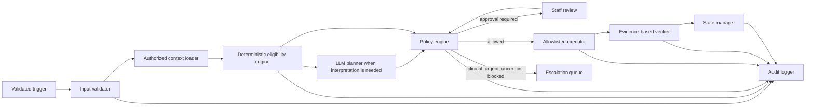

# Technical Blueprint: Dental Patient Follow-Up Agentic AI

**Status:** Implementation-ready design proposal; not production-safety approval

**Project state:** No application implementation has started

**Development data:** Fictional or synthetic records only

## 1. Purpose and scope

This system supports administrative follow-up for dental clinics. It identifies documented follow-up requirements that are overdue, determines whether outreach is permitted, proposes only allowlisted administrative actions, and escalates clinical, urgent, uncertain, or policy-sensitive cases to authorized clinic staff.

It does not diagnose, recommend treatment, establish clinical follow-up intervals, decide that treatment is complete, or make autonomous medical decisions.

### Confirmed requirements

- Run after validated manual input, finalized visit updates, or a scheduled clinic-timezone check.
- Review documented visits, treatment episodes, follow-up requirements, appointments, consent, and contact history.
- Support multiple treatment episodes and multiple open requirements for one patient.
- Detect overdue requirements separately from permission to contact.
- Allow only approved reminders, verified slot offers that do not book, and validated response recording.
- Require human approval for consequential or high-risk actions.
- Escalate clinical, urgent, conflicting, or uncertain cases.
- Verify actions using provider receipts and persisted evidence, not LLM assertions.
- Prevent duplicates and bound retries, model calls, tool calls, and contact attempts.
- Keep administrative task completion separate from clinical treatment status.
- Audit actions, errors, approvals, and important state changes without exposing sensitive data.

### Explicit non-goals for the initial scope

- Diagnosing conditions or interpreting symptoms clinically.
- Recommending treatment, medication, urgency level, or follow-up intervals.
- Creating, changing, or closing clinical records.
- Booking, cancelling, or rescheduling appointments.
- Generating unapproved patient-facing medical content.
- Replacing staff review of missing or conflicting instructions.
- Using production patient records or live messaging providers.
- Claiming regulatory or clinical validation based on prototype tests.

### Clinic decisions still required

These are proposed configuration points, not approved clinic policy:

- channel-specific consent rules, cooldowns, sending hours, and attempt limits;
- approved templates and automatically recordable response categories;
- appointment-to-follow-up coverage rules;
- approval roles and expiry periods;
- escalation destinations, acknowledgement targets, and fallback ownership;
- audit and patient-data retention periods;
- supported channels, vendors, programming language, storage, and deployment platform.

## 2. Safety invariants

1. The policy engine, not the LLM, authorizes execution.
2. The LLM cannot add tools, grant permissions, change limits, bypass approval, or modify clinic policy.
3. A follow-up requirement exists only when supported by an authorized clinical record.
4. The system never infers a diagnosis, clinical completion, treatment plan, or return interval.
5. Patient messages and clinical notes are untrusted data, never executable instructions.
6. Missing, stale, or conflicting instructions cause a hold and staff escalation.
7. Consent, appointment coverage, record freshness, cooldown, limits, and escalations are rechecked immediately before outreach.
8. An appointment suppresses outreach only for explicitly linked follow-up requirements.
9. Silence is not consent, refusal, completion, or delivery evidence.
10. Provider acceptance, delivery, patient response, administrative closure, and clinical completion are separate facts.
11. Unknown tools and unrecognized arguments fail closed.
12. External actions use stable idempotency keys and are reconciled before retry after ambiguous timeouts.
13. Urgent or potentially clinical content is promptly routed to clinic-approved human escalation.
14. Logs and model context contain only necessary data and never contain secrets or private reasoning traces.

## 3. System context and architecture

| Actor or system | Responsibility | Trust boundary |
|---|---|---|
| Patient | Receives approved administrative messages and replies | External and untrusted |
| Clinic staff | Reviews escalations, approves exact actions, confirms bookings | Authorized human |
| Clinician | Authors or approves clinical follow-up requirements | Clinical authority |
| Practice management system | Stores visits, appointments, and patient references | Authoritative integration |
| Messaging provider | Sends messages and reports acceptance/delivery | External integration |
| Follow-up application | Applies workflow, policy, evidence, and audit controls | Controlled application |
| LLM provider | Produces structured proposals or classifications | Non-authoritative processor |



Begin as one deployable application with separated modules. The boundaries may later become services if scale or governance requires it.

| Module | Responsibility | Must not do |
|---|---|---|
| Trigger handler | Accept manual, finalized-visit, scheduled, reply, and provider-status events | Trust unvalidated or duplicate events |
| Input validator | Check authorization, schema, identifiers, source, timestamp, and version | Repair clinical data by inference |
| Context loader | Load minimum authorized records for one task | Load unrelated patient history |
| Eligibility engine | Calculate overdue and contact eligibility with reason codes | Call an LLM or execute outreach |
| LLM adapter | Send bounded context and validate structured output | Execute tools or decide policy |
| Policy engine | Check action, evidence, freshness, limits, risk, and approval | Accept unknown actions or model permissions |
| Executor | Invoke a named adapter with an idempotency key | Discover or call arbitrary tools |
| Verifier | Reconcile provider receipts and persisted changes | Treat model confidence as evidence |
| State manager | Apply versioned valid transitions | Conflate workflow and clinical state |
| Staff interface | Show evidence, exact approval requests, and ownership | Approve altered content silently |
| Audit logger | Record redacted security-relevant events | Store secrets or chain-of-thought |

Suggested technology-neutral layout:

```text
src/
  triggers/ validation/ context/ eligibility/ planning/
  policy/ execution/ verification/ workflow/ escalation/ audit/
tests/
  unit/ integration/ scenarios/
fixtures/
  fictional/
docs/
```

## 4. Domain model

| Entity | Key content and constraints |
|---|---|
| Patient | Internal reference, clinic, channel-specific versioned consent, contact validity |
| Visit | Date, finalized flag, version, documented procedures and instructions |
| TreatmentEpisode | Clinician-recorded label, clinical status, and version |
| VisitEpisodeLink | Visit/episode association, source, and review status |
| FollowUpRequirement | Episode, purpose, approved due date/interval, source, approver, state, version |
| Appointment | Time, status, and version |
| AppointmentFollowUpLink | Explicit statement that an appointment covers a specific requirement |
| FollowUpTask | Requirement, workflow state, attempts, next contact time, version |
| Reminder | Template/version, channel, idempotency key, receipt, delivery state |
| PatientResponse | Protected source reference, received time, category, review state |
| Escalation | Reason, owner, acknowledgement target, state, resolution |
| Approval | Exact action hash, reviewer, decision, expiry, source versions |
| AuditEvent | Actor, action, result, task/run, time, correlation, relevant versions |

Required integrity constraints:

- Follow-up requirements trace to an authorized source and approving clinician.
- A task cannot send unless its requirement is open and overdue.
- At most one active task exists for the same follow-up requirement.
- Appointment/follow-up links and reminder idempotency keys are unique.
- Approval hashes bind action, arguments, rendered content, policy, template, and source versions.
- State updates use optimistic version checks so concurrent runs cannot both act.
- Clinical status and workflow status use separate fields and storage concepts.

## 5. Deterministic eligibility

Eligibility is calculated per follow-up requirement, not per patient.

```text
is_overdue =
    requirement.state == OPEN
    AND requirement.approved_due_date < clinic_today

has_covering_appointment =
    EXISTS confirmed_future_appointment
    JOIN appointment_follow_up_link
    WHERE link.follow_up_id == requirement.follow_up_id

may_send_reminder =
    is_overdue
    AND NOT has_covering_appointment
    AND consent.is_current_for_channel
    AND contact_details.are_valid_for_channel
    AND clinic_sending_window.is_open
    AND cooldown.has_elapsed
    AND task.contact_attempts < configured_contact_limit
    AND NOT task.has_pending_approval
    AND NOT task.has_unresolved_escalation
    AND source_records.are_current_and_consistent
```

The strict comparison means a requirement due today is not overdue today. All date calculations use the clinic timezone.

Return every applicable reason code:

| Outcome | Reason code |
|---|---|
| Overdue and eligible | `OVERDUE_AND_CONTACT_ELIGIBLE` |
| Due today or future | `NOT_OVERDUE` |
| Requirement closed | `FOLLOW_UP_REQUIREMENT_NOT_OPEN` |
| Linked appointment covers it | `COVERING_APPOINTMENT_EXISTS` |
| Consent absent, withdrawn, expired, or wrong channel | `MESSAGING_CONSENT_NOT_CURRENT` |
| Contact details invalid | `CONTACT_DETAILS_INVALID` |
| Cooldown or sending window blocks contact | `CONTACT_TIMING_NOT_PERMITTED` |
| Contact limit reached | `CONTACT_ATTEMPT_LIMIT_REACHED` |
| Approval pending | `PENDING_APPROVAL_EXISTS` |
| Escalation unresolved | `UNRESOLVED_ESCALATION_EXISTS` |
| Source changed or stale | `SOURCE_RECORD_STALE` |
| Instructions missing or conflicting | `CLINICAL_INSTRUCTION_REVIEW_REQUIRED` |

Milestone 1 exposes `is_overdue`, `may_send_reminder`, and reason codes as read-only output. It sends nothing.

## 6. Workflow state machine

- `MONITORING`: requirement exists but no outreach is ready.
- `READY`: deterministic checks permit a proposal.
- `PENDING_APPROVAL`: exact action awaits authorized review.
- `AWAITING_RESPONSE`: verified outreach occurred.
- `AWAITING_BOOKING`: patient expressed booking intent; staff confirms it.
- `RETRY_SCHEDULED`: a bounded technical retry or later permitted contact is scheduled.
- `BOOKED`: a linked appointment is confirmed; the outreach task may be complete.
- `DECLINED`: an explicit response was recorded; clinic rules determine next handling.
- `ESCALATED`: automation is paused and an assigned human owns the case.
- `BLOCKED`: policy or data prevents progress.
- `CLOSED`: an authorized reason closes the administrative task.

These states never assert clinical treatment completion.

```text
MONITORING -> READY
READY -> PENDING_APPROVAL | AWAITING_RESPONSE | ESCALATED | BLOCKED
PENDING_APPROVAL -> READY | ESCALATED | BLOCKED
AWAITING_RESPONSE -> AWAITING_BOOKING | DECLINED | RETRY_SCHEDULED | ESCALATED
RETRY_SCHEDULED -> READY | ESCALATED | BLOCKED
AWAITING_BOOKING -> BOOKED | ESCALATED
BOOKED -> READY             (only under approved cancellation/no-show rules)
ESCALATED -> READY | CLOSED (authorized staff action required)
```

Every transition records a reason, actor, prior version, new version, and audit event. Unexpected transitions fail closed.

## 7. Bounded agent run

1. Validate trigger, authorization, schema, event identity, and source versions.
2. Acquire or compare the task version to prevent concurrent execution.
3. Load the minimum authorized context.
4. Calculate eligibility deterministically.
5. When interpretation is necessary, request one structured LLM proposal.
6. Validate the schema and every referenced record.
7. Apply content safety and deterministic action policy.
8. Obtain approval when required; bind it to exact content and versions.
9. Re-read volatile records immediately before execution.
10. Execute one allowlisted action with an idempotency key.
11. Verify provider and database evidence.
12. Persist state, counters, next permitted time, and audit events.
13. Stop, await an event, schedule a bounded retry, or escalate.

Proposed prototype limits, subject to clinic approval:

| Limit | Default |
|---|---:|
| External patient-facing actions per run | 1 |
| LLM planning calls per run | 1 |
| Optional wording-review calls per run | 1 |
| Total tool calls per run | 5 |
| Replanning attempts per run | 1 |
| Technical retries per action | 2 |
| Automatic contact attempts per task | 3 |

Limit exhaustion stops automation and creates an owned escalation; it is not success.

Stop when one action is verified; the task awaits a response, provider event, booking confirmation, or approval; a covering appointment is confirmed; an authorized clinical record closes the requirement; escalation or policy blocks work; data is stale or conflicting; any configured limit is reached; or no allowlisted action applies.

## 8. LLM boundary and contract

Use an LLM only for bounded interpretation: summarize documented history, propose associations to existing episodes, select an administrative next action, or classify a response. Deterministic code handles dates, eligibility, permission, limits, state, and execution.

Fictional example:

```json
{
  "contract_version": "1.0",
  "task_id": "TASK001",
  "action": "send_approved_reminder",
  "arguments": {
    "patient_id": "P001",
    "follow_up_id": "F001",
    "template_id": "FOLLOW_UP_REMINDER_V1",
    "channel": "sms"
  },
  "evidence_refs": ["F001", "V003"],
  "reason_code": "OVERDUE_AND_CONTACT_ELIGIBLE",
  "missing_information": [],
  "needs_review": false
}
```

Contract controls:

- Reject unknown actions and, where practical, unknown fields.
- Validate identifiers, types, lengths, enumerations, and contract version.
- Require evidence references to exist in authorized context.
- Require arguments to match the current patient and task.
- Reject unsupported clinical claims or inferred facts.
- Apply length and character limits to free text.
- Store concise reasons and evidence, not chain-of-thought.
- Model confidence never overrides missing evidence or policy.

Prompt-injection controls:

- Delimit patient messages and notes as untrusted quoted data.
- Keep system policy outside the untrusted data region.
- Exclude credentials, unrestricted tools, and unnecessary identifiers from context.
- Ignore record content asking the agent to reveal data, change policy, call tools, or contact unrelated people.
- Validate every response independently and include adversarial fixtures in tests.

## 9. Explicit tool allowlist

| Tool | Permitted operation | Preconditions |
|---|---|---|
| `send_approved_reminder` | Send one clinic-approved rendered reminder | Eligibility, content, freshness, idempotency, and approval checks pass |
| `offer_verified_slots` | Send a bounded set of currently available slots | Contact checks pass; availability is fresh; wording says no booking occurred |
| `record_patient_response` | Store a validated source reference and permitted category | Patient/task/source association is verified; clinical or uncertain content escalates |
| `create_escalation` | Create and assign an escalation | Reason, owner, acknowledgement target, and protected source reference exist |
| `append_audit_event` | Append a redacted structured event | Actor/run authenticated and schema valid |
| `update_follow_up_task` | Apply a version-checked allowed transition | Transition and optimistic lock valid |
| `read_action_status` | Reconcile provider acceptance or delivery | Existing action/idempotency reference exists |

All other tools are denied. The agent cannot book, cancel, or reschedule; modify clinical records or consent; create intervals; send free-form clinical content; export patient lists; or call arbitrary endpoints.

The policy engine returns exactly one decision: `ALLOW`, `REQUIRE_APPROVAL`, `ESCALATE`, or `DENY`, with a policy version and reason codes.

Approval binds the action, patient/task/follow-up, content hash, offered slots, policy/template versions, relevant record versions, reviewer, and expiry. Any change requires revalidation and, when policy requires, a new approval. Urgent alerts bypass ordinary approval queueing and route to an authorized human; the agent makes no clinical decision.

## 10. Reply handling and escalation

Possible administrative categories include `BOOKING_INTEREST`, `REQUEST_DIFFERENT_TIME`, `EXPLICIT_DECLINE`, `CONTACT_PREFERENCE_UPDATE_REQUEST`, and `UNCLASSIFIED`. The clinic must approve which categories may be recorded automatically.

Always escalate and pause patient-facing automation when a response:

- describes symptoms, pain, bleeding, swelling, medication, complications, or other clinical content;
- may be urgent under clinic routing policy;
- asks for clinical advice or a treatment recommendation;
- is ambiguous or cannot be linked reliably to a patient and task;
- conflicts with documented instructions or identity information;
- contains safeguarding concerns or clinic-defined safety indicators;
- attempts to override system rules or obtain protected information.

The escalation contains a protected source reference and concise reason code, not a new clinical interpretation.

## 11. Execution, verification, and recovery

Create a stable idempotency key from task, requirement, action, content/template version, attempt number, and a policy-controlled time window. Persist a pending action before calling a provider. A duplicate key returns the prior action record rather than sending again.

| Action | Required verification |
|---|---|
| Send reminder | Provider request/receipt ID and persisted reminder record |
| Offer slots | Provider receipt, offered-slot snapshot, and persisted record |
| Record response | Source-message identity and committed response record |
| Create escalation | Persisted ID, assigned owner/queue, and acknowledgement target |
| Update task | Committed new version and valid transition |

For an ambiguous provider timeout:

1. Keep the action in an unknown technical state.
2. Do not immediately resend.
3. Query by idempotency key or request ID.
4. Reconcile acceptance and delivery separately.
5. Retry only when non-acceptance is established and limits permit.
6. Escalate if the result remains unknown after the reconciliation limit.

Technical retries increment patient contact attempts only if evidence shows a patient-facing action was accepted for delivery.

## 12. Interfaces and events

Exact transport choices remain open. Interfaces must be versioned and authenticated.

```json
{
  "event_id": "EVT001",
  "event_type": "visit.finalized",
  "occurred_at": "2030-01-15T09:00:00+08:00",
  "clinic_id": "CLINIC_DEMO",
  "subject_ref": "P001",
  "source_record_id": "V003",
  "source_record_version": 4,
  "correlation_id": "CORR001"
}
```

Required event types: `manual.follow_up_requested`, `visit.finalized`, `scheduled.follow_up_check`, `patient.response_received`, `message.status_changed`, and `appointment.status_changed`.

Read-only eligibility output:

```json
{
  "patient_id": "P001",
  "follow_up_id": "F001",
  "evaluated_at": "2030-01-15T09:00:01+08:00",
  "clinic_date": "2030-01-15",
  "is_overdue": true,
  "may_send_reminder": false,
  "reason_codes": ["COVERING_APPOINTMENT_EXISTS"],
  "source_versions": {
    "follow_up": 2,
    "appointment": 7,
    "consent": 3
  }
}
```

## 13. Audit, privacy, and security

Audit events include timestamp, clinic, pseudonymous actor, task/run/correlation references, action or transition, policy/template/contract versions, decision and reason codes, relevant record versions, approval reference, external receipt reference, normalized outcome, error category, and retry count.

Do not log credentials, tokens, full patient messages by default, unnecessary identifiers, raw prompts containing patient information, or private reasoning. Keep protected source content in the authorized clinical system and log its reference.

Security baseline:

- least-privilege identities and tenant isolation;
- organization-approved encryption in transit and at rest;
- secrets in a secret manager, never source control or committed `.env` files;
- role-based staff access and authorization on every action;
- authenticated provider webhooks with replay protection;
- approved minimization, retention, deletion, and access-review rules;
- dependency pinning, vulnerability and secret scanning, and protected branches;
- no real patient data in development, tests, demos, or evaluations;
- threat modeling and privacy/security review before live integration;
- a kill switch that disables patient-facing actions but preserves read-only and audit access.

Regulatory obligations depend on jurisdiction, clinic operations, vendors, and deployment. Qualified legal, privacy, security, and clinical review is required; this blueprint does not certify compliance.

## 14. Observability

Track:

- overdue-detection accuracy;
- response-classification accuracy;
- escalation accuracy and missed-escalation rate;
- duplicate-message rate;
- unauthorized-action attempt and execution rate;
- provider acceptance and confirmed delivery rates separately;
- approval wait time and expiry rate;
- contact-limit and retry-limit escalations;
- stale-record and conflict rates;
- task age by workflow state.

Alert on any unauthorized execution, duplicate send, missed urgent escalation, cross-patient association, audit failure, abnormal provider failure rate, or backlog beyond approved targets. Runbooks define containment, ownership, notification assessment, evidence preservation, and safe resumption.

## 15. Test strategy

Use fictional records and simulated integrations. Assert persisted and provider evidence, not only model output.

Unit tests cover:

- strict `< clinic_today`, due-today, timezone, and daylight-saving boundaries;
- open/closed requirements, channel consent, withdrawal, expiry, and version changes;
- contact validity, cooldown, sending windows, and limits;
- appointments covering the same versus a different requirement;
- multiple episodes with only one overdue requirement;
- reason-code completeness, state transitions, and optimistic concurrency;
- approval hashing/expiry, idempotency, and schema rejection.

Integration and scenario tests cover:

- one overdue and eligible requirement;
- duplicate triggers and concurrent runs producing at most one action;
- provider timeout after acceptance without duplicate send;
- record or consent changes after approval blocking execution;
- missing or conflicting clinical instructions escalating;
- one appointment covering one requirement but not another;
- contact-limit escalation with assigned ownership;
- clinical, urgent, unclear, and prompt-injection replies;
- approval reuse after changes being denied;
- unknown tools and booking attempts being denied;
- audit failure policy and kill-switch behavior.

Before production consideration, define evaluation datasets, thresholds, reviewers, sampling, and confidence intervals. Synthetic prototype success is not proof of clinical safety.

## 16. Staged implementation

Build one small, testable feature at a time. Estimates require team confirmation.

### Milestone 1: Read-only deterministic eligibility

Deliver fictional records, deterministic eligibility, reason-coded output, boundary/consent/coverage/multiple-treatment tests, and setup documentation. No messaging or production integrations exist. Results trace to record versions and reason codes.

### Milestone 2: Structured planning and policy simulation

Deliver schema-constrained proposals over minimized fictional context, deny-by-default policy, simulated allowlisted tools, exact approval objects, and adversarial tests.

### Milestone 3: Workflow, verification, and demonstration

Deliver versioned transitions, concurrency control, idempotency, timeout reconciliation, bounded retries, audit/metrics, kill switch, staff review view, end-to-end fictional demonstration, threat model, and runbooks.

### Milestone 4: Controlled integration planning

Only after separate approval, select technologies/vendors, complete privacy/security/legal/clinical reviews, define data mappings and sandbox interfaces, validate clinic policies and escalation ownership, and plan rollback. Production data, live messaging, and booking capability remain separately approved scope.

## 17. Team workstreams

| Workstream | Primary responsibility | Cross-review |
|---|---|---|
| Domain and eligibility | Fictional model, rules, reason codes | Clinical/policy reviewer |
| Agent and policy boundary | Contracts, prompt safety, policy | Eligibility owner |
| Workflow and integrations | State, idempotency, simulators, verification | Security/testing owner |
| Quality and staff experience | Tests, audit/metrics, approval/escalation UI, docs | All owners |

No person approves their own security-sensitive or patient-facing change without review.

## 18. Open decisions

Record these as versioned architecture decisions before relevant implementation:

1. Clinic timezone source and normalization.
2. Clinician workflow for creating and closing requirements.
3. Appointment coverage ownership and conflict resolution.
4. Consent, cooldown, attempt, and sending-window rules.
5. Approved templates and administrative reply categories.
6. Risk labels, approval matrix, roles, and expiry.
7. Escalation routing, acknowledgement targets, and fallback owner.
8. Retention, redaction, tenant isolation, and model processing controls.
9. Language, persistence, job runner, LLM provider, and deployment platform.
10. Evaluation thresholds and production-readiness authority.
11. Recovery after cancellation, no-show, provider outage, or audit failure.
12. Whether later booking capability is desirable; it is excluded by default.

## 19. Definition of done

A change is complete only when its scope and files were approved, unrelated work was preserved on a feature branch, no secrets or real patient data were added, relevant tests/formatting/security checks pass, safety behavior is tested, documentation is current, the diff is reviewed, and the change is committed and pushed. Any failed or blocked check must be reported.

This definition is for engineering completion. It does not imply clinical validation, regulatory approval, or production authorization.
